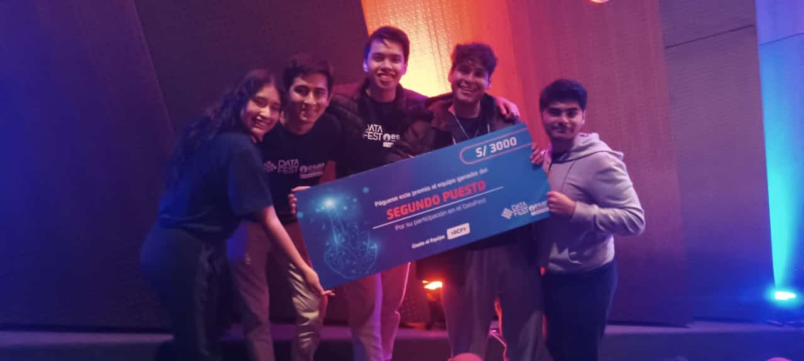

# DATAFEST 2024 - ESAN & BCP 🎉

[**Datafest 2024**](https://www.linkedin.com/posts/universidad-esan_as%C3%AD-arranc%C3%B3-el-datafest-2024-en-esan-activity-7245619294036725760-JMPw/?originalSubdomain=es) is the most prominent and challenging data analytics event in Peru, where 11 universities compete in an exciting contest of analyzing real-world data. This year, our goal was to develop an **innovative solution** to optimize the replenishment of BCP's ATMs by combining a predictive demand model with an optimization algorithm to maximize operational efficiency and minimize costs. 💡💰

## Challenge and Solution

The challenge was to **optimize cash management** in BCP's ATMs, ensuring cash availability for customers. Two key strategies were identified:

1. **Predicting cash demand.** 📊
2. **Optimizing cash replenishment.** ⚙️

After presenting our proposal to a jury composed of experts in management and data analytics, we are proud to have achieved **second place** in the competition! 🥈

## Lessons Learned

1. **Focus on the business problem:** Concentrating on the real problem enriched our proposals and led to effective strategy design.
2. **Deep understanding of the context:** Taking the time to understand the problem and its environment helped us formulate solutions tailored to the business reality.
3. **Data quality:** Ensuring the integrity of the data used was essential for the reliability of our predictions and recommendations. 📈

## Team

The team responsible for developing this solution included:
- [Díaz, Walter](https://www.linkedin.com/in/waltdiaz/)
- [Ramón, Eduardo](https://www.linkedin.com/in/eram%C3%B3n/)
- [Rodas, Gustavo](https://www.linkedin.com/in/gustavo-rodas/)
- [Saucedo, Renzo](https://www.linkedin.com/in/renzosaucedos/)
- [Villalva, Diana](https://www.linkedin.com/in/diana-villalva-gomez-346a93272/)

